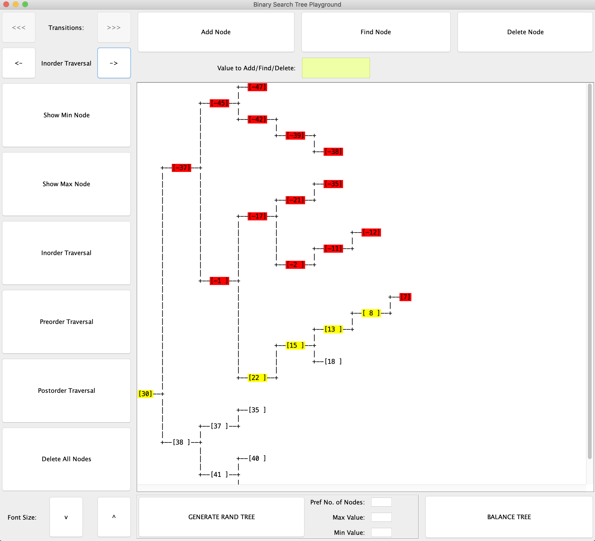

# Tree-Modelling-Tool
Create and modify, tree data structures, visualise the changes step by step

## Currently in progress:
1. AVL Tree rebalancing step by step
2. Red Black Tree

## Installation:
There is an BST-Tool.jar artifact attached in releases. JRE that supports at least Java 8 is needed to run it (v. 251).

## Usage:

User can:
* see the change after each modification of the tree
* browse all transitions of each step of the algorithms
* see colourful representation of algorithm steps
* add nodes
* delete nodes
* generate pseudorandom tree
* balance tree
* find nodes
* display traversal results (inorder, preorder, postorder)
* delete all nodes
* adjust font

