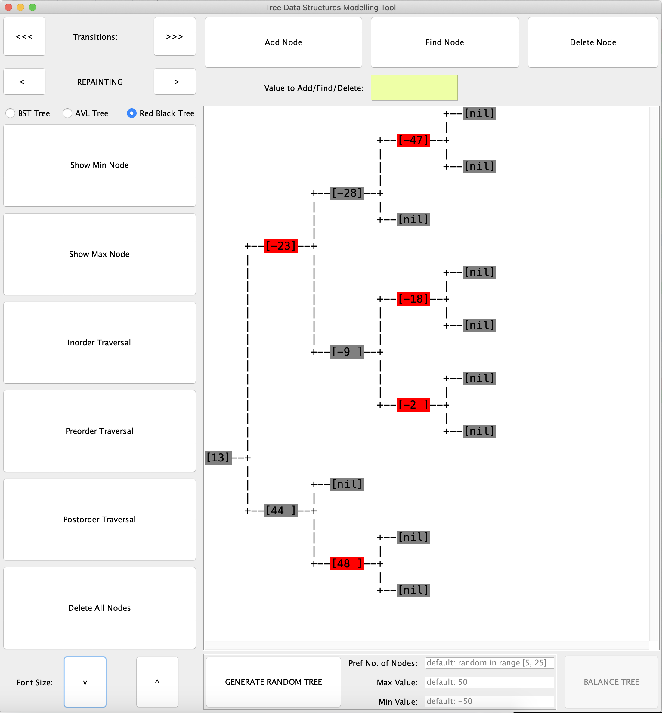

# Tree-Modelling-Tool
Create and modify, tree data structures, visualise the changes step by step

## Currently, in progress:
1. AVL tree balancing step by step
2. Red black tree balancing step by step
3. Min/Max heap
4. Binary Tree data structure
5. Feature to add one tree's nodes into a new selected tree
6. Automatic preorder/inorder/postorder selectable hint for any tree on display. 

## Installation:
There is an Tree Modelling Tool.jar artifact attached in releases. JRE that supports at least Java 8 is needed to run it (v. 251).

## Usage:

User can:
* see the change after each modification of the tree
* browse all transitions of each step of the algorithms
* see colourful representation of algorithm steps
* add nodes
* delete nodes
* generate pseudorandom tree
* balance tree
* find nodes
* display traversal results (inorder, preorder, postorder)
* delete all nodes
* adjust font

